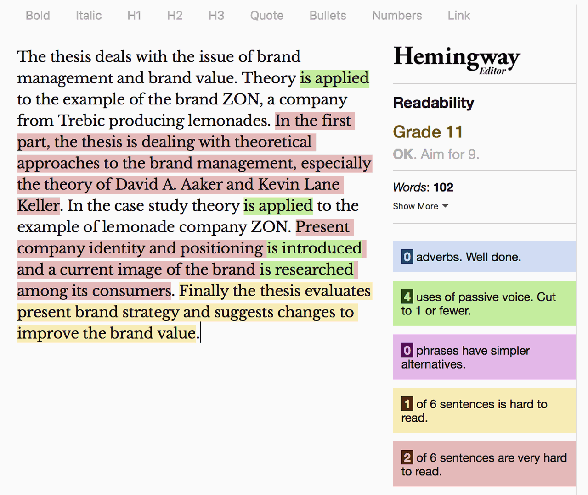

# Thesis Digest

- [Brief](#brief)
- [Warm-Up](#warm-up)
- [Details](#details)
  - [Abstract](#abstract)
    - [Types](#types)
    - [Examples](#examples)
  - [Main Text](#main-text)
- [Handoff](#handoff)
- [Readings](#readings)
- [Resources](#resources)

## Brief

> To write or even speak English is not a science but an art. There are no reliable words. Whoever writes English is involved in a struggle that never lets up even for a sentence. He is struggling against vagueness, against obscurity, against the lure of the decorative adjective, against the encroachment of Latin and Greek, and, above all, against the worn-out phrases and dead metaphors with which the language is cluttered up.
>
>―[George Orwell](https://www.orwellfoundation.com/the-orwell-foundation/orwell/essays-and-other-works/why-i-write/), author and critic

Revisit and review language developed for [Clarity First](08-clarify-first.md) and write a thesis digest with an expanded and well-formed abstract and main text, references, and images. Use the PAR/PEEL methods for structure, academic voice, and accessible language.

- See [Readings](#readings) and [Resources](#resources) for guidance, specifically [Digest Writing Guides](#digest-writing-guides).

## Warm-Up

Answer these two writing prompts to differentiate between your Motivation/Problem/Opportunity and your Thesis statement.

> **Motivation/Problem/Opportunity (1 sentence minimum)**
>
> The abstract is often introduced with the motivation, background context, or problem, that frames the circumstances in which the research and article will be discussed.

> **Thesis (1 sentence minimum)**
>
> A thesis is an original argument made about a specific topic which you claim to have knowledge of or expertise in because of the research you conducted prior to presenting or writing about the topic. Is the thesis statement clear and unique/original? Is it grounded within an established discipline or area of study?

- From [Academic Abstract Outline Wizard](https://designincubation.com/abstract-wizard/)

## Details

> This topic, this thesis, this paper, includes, focuses, deals, explores, etc.

Options. Choose your words and phrases or terms with care, meaning, with serious consideration. The use of academic voice makes writing with style a challenge.

> The main goal, the aim, of this thesis is to evaluate, etc.

Replace personal with enthusiasm and knowledge of the subject matter, and entice us with a meaningful thesis and hints of valuable research.

Find an abstract that is relevant and inspirational, topic and grammar-wise, and use it as a guide to get started.

For example:

> **Abstract:**
>
> The thesis deals with the issue of brand management and brand value. Theory is applied to the example of the brand ZON, a company from Trebic producing lemonades. In the first part, the thesis is dealing with theoretical approaches to the brand management, especially the theory of David A. Aaker and Kevin Lane Keller. In the case study theory is applied to the example of lemonade company ZON. Present company identity and positioning is introduced and a current image of the brand is researched among its consumers. Finally the thesis evaluates present brand strategy and suggests changes to improve the brand value.
>
>—Vendula Nováková, [Brand management of the "ZON" brand on the Czech market](https://explore.openaire.eu/search/publication?articleId=od______2186::7b0f5d59275480880ee1f4a77a61c5a6)

Remember to use academic voice and use a [content buddy](#writing-tips) like Hemingway or Grammarly Editor to omit adverbs, use active voice in place of passive voice, add missing articles, etc.



### Abstract

Write either a descriptive or informative abstract based on your topic.

#### Types

> **Critical Abstract:**
> A critical abstract provides, in addition to describing main findings and information, a judgment or comment about the study’s validity, reliability, or completeness. The researcher evaluates the paper and often compares it with other works on the same subject. Critical abstracts are generally 400-500 words in length due to the additional interpretive commentary. These types of abstracts are used infrequently.
>
> **Descriptive Abstract:**
> A descriptive abstract indicates the type of information found in the work. It makes no judgments about the work, nor does it provide results or conclusions of the research. It does incorporate key words found in the text and may include the purpose, methods, and scope of the research. Essentially, the descriptive abstract only describes the work being summarized. Some researchers consider it an outline of the work, rather than a summary. Descriptive abstracts are usually very short, 100 words or less.
>
> **Informative Abstract:**
> The majority of abstracts are informative. While they still do not critique or evaluate a work, they do more than describe it. A good informative abstract acts as a surrogate for the work itself. That is, the researcher presents and explains all the main arguments and the important results and evidence in the paper. An informative abstract includes the information that can be found in a descriptive abstract [purpose, methods, scope] but it also includes the results and conclusions of the research and the recommendations of the author. The length varies according to discipline, but an informative abstract is usually no more than 300 words in length.
>
> **Highlight Abstract:**
> A highlight abstract is specifically written to attract the reader’s attention to the study. No pretense is made of there being either a balanced or complete picture of the paper and, in fact, incomplete and leading remarks may be used to spark the reader’s interest. In that a highlight abstract cannot stand independent of its associated article, it is not a true abstract and, therefore, rarely used in academic writing.
>
> —[Types of Abstracts](https://libguides.usc.edu/writingguide/abstract)

### Examples

From basic and vague, to almost there — a sampling of abstracts.

#### Basic

A standard pattern you may want to avoid: This thesis consists of a theoretical part, a practical part, etc. It is adequate but not compelling and does not include any enthusiasm or style. It gets the job done if that is what your thesis is all about. Although, the main goal is to write better than that.

> **Abstract:**
>
> The topic of this bachelor’s thesis is Promotion of the Czech Republic abroad through Czech centres. Theoretical part of the thesis includes theory of tourism and marketing and their specific parts but also theory of translation and its processes. Practical part uses the knowledge from the theoretical part in order to analyse the product of the Czech centres. The main goal of this thesis is to describe how the Czech centres work using comparative and SWOT analyses and also to make suggestions for their potential improvement.
>
> **Keywords:**
>
> Tourism, marketing, marketing in tourism, marketing mix, art marketing, translation, Czech centres, promotion, social networks, promotional material
>
> –Filip Eichler, Marketing

#### Vague

Is it really saying something, anything? The motivation is there, but it is missing evidence and a conclusion. And what’s the thesis?

> **Abstract**
>
> This thesis focuses on conception and design of a mobile app for receipt management.
The main aim is to make recording, management and manipulation with receipts more
convenient and efficient. The app targets simple digitization of hard-copied receipts,
recording of a warranty period and education in consumer law. Steps of designing this
app reflect real process that is followed during professional and/or commercial app
development.
>
> Key words: Mobile application, User Experience, User Interface
>
> –Jaroslav Janouš, Graphic Design

#### Better

Excellent content and style, with the second paragraph developing into the expanded digest format, but needs a revision for better academic voice (sans first personal pronoun, I, and determiner, My, and other informal language instances). Yet, it has potential with some edits.

> **Abstract**
>
> This paper focuses on a personal brand of a designer. Possible approaches and changes of
any visual content and analysis of suitable channels through designers can communicate
with their audience. At the same time, it points out various advantages and disadvantages.
Resources from such fields as marketing, psychology, research technology and, last but not
least, especially the creative sector, were used for this work. My research shows that social
networks such as Instagram and online creative platforms such as Behance and Dribbble
provide best practices for building a designer brand quickly and properly. Online marketing
is also an excellent opportunity to strengthen any brand and reputation.
>
> Based on the available results, I came to the conclusion that, for example, marketing
opportunities such as the social network Facebook are less suitable than Instagram. And how
important it is to think about your own brand before starting the creative process itself. It is
also important to explore other possible content for future designers who want to build their
personal brand using internet and related networks.
>
> Keywords: personal brand, branding, graphic design, portfolio, online marketing, brand,
designer, social networks.
>
> –Barbora Dostálová, Graphic Design

- See also [Working with Urban Informality: A Postcolonial Critique of Planning Theory based on Lessons from the Caño Martín Peña Special Planning District](https://www.gsd.harvard.edu/project/working-with-urban-informality-a-postcolonial-critique-of-planning-theory-based-on-lessons-from-the-cano-martin-pena-special-planning-district/) by Samantha Saona


### Main Text

Consider these four sections:

1. Introduction that puts the research in a broader context and provides added value through citations not included in the original article.
2. Summary of original article’s methods and results.
3. Further discussion on significance of findings.
4. Discussion connecting this work to other studies – provides added value through citations not included in original study.

## Handoff

### Setup

- Create a project folder (repo) with a Markdown file and an image folder/file(s).
  - For example:
    - `10-thesis-digest`
      - `index.md`
      -  `img`
          - `*.png`

### Format

- `index.md`

```
# Title: Digest: <!-- Please limit the title to around **100–125 characters** or less (think — alt text). -->-->

# Running Title: …

<!--
A running title is an abbreviated form of the main title, usually cited at the top of each published page or left-hand text pages.

If your title is already short, use your actual title. If your title is not very short, use an abbreviated version of it as the running title.
-->

Author Name(s): …

E-mail(s): …

Acknowledgement(s): …

Data Accessibility/Availability Statement: There is no data archived.

<!-- See https://www.cambridge.org/core/services/authors/open-data/data-availability-statements -->

Word count: <!-- Digests should be approximately 500 words. Everything below, including headings, image captions, etc., except references. -->

- - -

# Digest: <!-- Full title from above -->

## Abstract

<!-- A descriptive (100 words or less) or an informative abstract (300 words or less; aim for half, around 150 words or less, but write first, edit second.-->

## Keywords

<!-- comma separated terms, all in lowercase letters (except for proper nouns), and arranged alphabetically  -->

## Main Text

<!--
Consider these four sections:

1. Introduction that puts the research in a broader context and provides added value through citations not included in the original article.
2. Summary of original article’s methods and results.
3. Further discussion on significance of findings.
4. Discussion connecting this work to other studies – provides added value through citations not included in original study.
 -->

## References

<!-- Use an unordered list, arranged alphabetically by author’s surname.  -->

## Images

<!-- Original figure(s) and caption(s) designed by digest author. And remeber to optimize images. -->
```

## Readings

- [Writing an Academic Research Abstract: For Communication Design Scholars](https://designincubation.com/publications/white-papers/writing-an-academic-research-abstract-for-communication-graphic-design-researchers-scholars/)
- [What makes writing more readable?](https://pudding.cool/2022/02/plain/)

## Resources

### Academic Voice

- [Finding Your Academic Voice](https://owl.excelsior.edu/writing-process/finding-your-voice/finding-your-voice-academic-voice/)
- [Overview of Academic Voice](https://writingcenter.uagc.edu/academic-voice)
- [Tips on Academic Voice](https://owl.excelsior.edu/writing-process/finding-your-voice/finding-your-voice-tips-on-academic-voice/)

### Digest Writing Guides

- [Sample Digest](https://sites.duke.edu/evodigests/files/2021/05/Sample-Annotated-Digest.pdf)
- [Digest Writing Instructions](https://sites.duke.edu/evodigests/writing-instructions/)

### Reference List Style

- [APA: Formatting Your References List](https://writingcenter.uagc.edu/format-your-reference-list)

### Writing Methods

- [PEEL (Point, Evidence, Explain, and Link) Structure](https://www.youtube.com/watch?v=3JMsmzhs804)
- [PAR Statements - The best weapon in your arsenal!](http://resumefactor.blogspot.com/2011/09/par-statements-best-weapon-in-your.html)

### Writing Tips

- [Writing a Thesis Statement](https://writingcenter.uagc.edu/writing-a-thesis)
- [The Ultimate Guide to Writing a Thesis Statement](https://www.grammarly.com/blog/thesis-statement/)
- [Content Buddy](https://adactio.com/journal/17906) by Jeremy Keith
  - [Content Buddy](https://adactio.com/journal/10654) (from 2016)

### Writing Tools

- [Academic Abstract Outline Wizard](https://designincubation.com/abstract-wizard/)
- [Grammarly Editor](https://app.grammarly.com)
- [Hemingway Editor](https://www.hemingwayapp.com)
